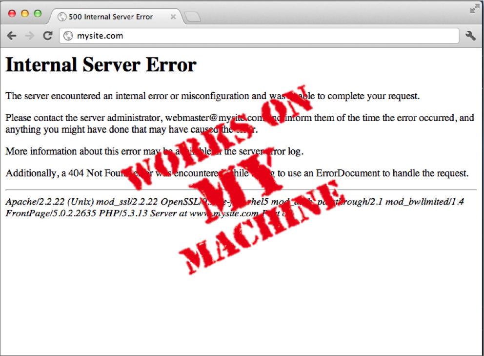
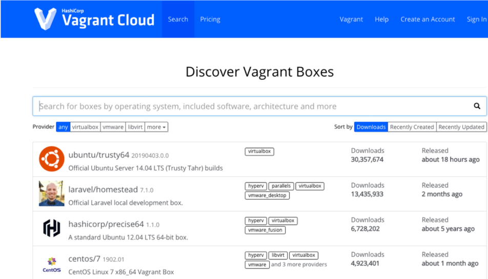

# Introducció a Vagrant

Vagrant és una eina pensada per simplificar la feina de crear entorns virtuals de desenvolupament. Quan es programa, és molt important desenvolupar en un entorn amb les mateixes característiques que el de producció, per exemple, quan es creen aplicacions web en PHP, és necessari utilitzar la mateixa versió tant en desenvolupament com en producció, per evitar problemes de incompatibilitats, instruccions que canvien, etc.

El problema és que si treballem amb diferents entorns de producció, caldria anar modificant les configuracions del nostre ordinador per adaptar-lo als diferents casos. La solució per evitar això, és la virtualització. Usant màquines virtuals puc recrear en el meu equip un sistema que tingui les mateixes característiques: sistema operatiu, framework, etc. que la màquina on finalment s'executarà l'aplicació.

Configurar entorns virtuals, pot ser una tasca complexa i repetitiva, de manera que voldríem disposar d'alguna eina que ens permeti desplegar aquests entorns virtuals d'una forma senzilla i automatitzable.

Vagrant és una eina que ens permetrà realitzar aquesta automatització d'entorns virtuals, situant-se en una capa superior als virtualitzadors, de manera que simplifica aquestes tasques d'automatització i desplegament. Permet aprovisionar entorns virtuals sobre VirtualBox, hyperV, VMware, Parallels en entorn local i sobre entorns remots com AWS, Azure o Digital Ocean.

Seguint la filosofia de definir la infraestructura com codi (IaC), Vagrant desenvolupada amb Ruby per Michell Hashimoto al 2010 com una eina Open Source i multiplataforma, no només permet gestionar els entorns virtuals mitjançant un arxiu de configuració (Vagrantfile), si no que permet aprovisionar els entorns creats amb eines com Ansible, Chef, Puppet i Salt o directament mitjançant scripts.

Per entendre el model de funcionament de Vagrant, aquest esquema és força clarificador:

Els *providers* són els sistemes on s'executarà l'aplicació, que com en esmentat abans són els virtualitzadors més habituals.

Els *boxes* són les plantilles a partir de les quals es desplegaran les màquines vagrant. Podríem dir que són com les OVA que s'han popularitzat en el món de la virtualització.

Els *provisioners* són les eines que ens permetran personalitzar l'entorn. Això és important perquè imaginem que estem desenvolupant per servidors Ubuntu Server, però amb diferents configuracions (Apache o ngix, PHP o Python, etc.). Si haguèssim de tenir una box per cadascun dels casos, els requeriments d'emmagatzematge es dispararien. És molt més pràctic disposar d'una box comuna per a tots i personalitzar al moment de crear l'entorn, però no volem fer-ho a mà cada cop, és aquí on entren els provisioners per automatitzar aquestes accions.

L'arxiu *Vagantfile* serà on tindrem la definició de l'entorn en concret. És un arxiu en format ruby.

Per últim, Vagrant ens proporciona un conjunt de comandes per gestionar el procés, de manera que també es pot automatitzar mitjançant scripts.

Un dels aspectes més potents de Vagrant és la flexibilitat a l'hora d'utilitzar boxes. Els podem crear nosaltres, però Hashicorp, la companyia que dona suport a Vagrant, ofereix un cloud d'on podrem descarregar i publicar boxes. Té diferents plans des del gratuït per publicar box públics a de pagament on podem tenir els nostres boxes de forma privada.

De tota manera, podem descarregar un box simplement indicant la URL sense necessitat que estigui allotjat a Vagrant Cloud.